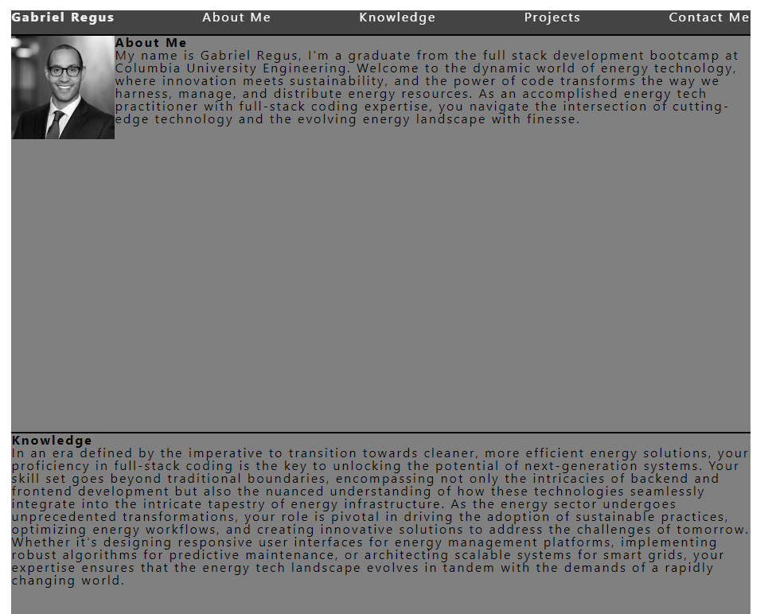

# Gabriel's Developer Portfolio

## Table of Contents

* [Description](#description)
* [Links](#links)
* [Purpose](#purpose)
* [Screenshots](#screenshots)
* [Technologies Used](#technologies)
* [Licence](#license)
* [Credits](#credits)
## Description

This is a developer Portfolio for Gabriel Regus

## Links

<a href="https://github.com/ColumbiaCoding/Gabes_Portfolio_Lyfe/">Deployed</a>

## Purpose

This is a portfolio webesite 
## Screenshots

## Technologies

## License

## Credits
